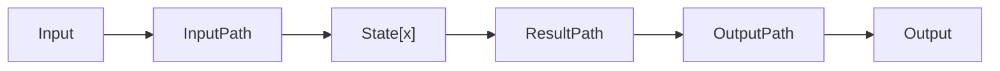

# Summary

AWS Step Functions lets you coordinate multiple AWS services into serverless workflows so you can build and update apps quickly. Using Step Functions, you can design and run workflows that stitch together services such as AWS Lambda and Amazon ECS into feature-rich applications.

# Links

- [Docs](https://docs.aws.amazon.com/step-functions/latest/dg/welcome.html)
- [Serverless Orchestration with AWS Step Functions](https://www.youtube.com/watch?v=8rmgF-SbcIk)
- [Sample](https://github.com/aws-samples/aws-step-functions-ebs-snapshot-mgmt)

# Coordination must-haves

- Scales out
- Doesn't lose state
- Deals with errors/timeouts
- Easy to build & operate
- Auditable

# Use Cases

- Workflow Management
- Batch processing
- Shell-script replacement
- Enterprise application workflows
- Data gathering and processing
- Automate Tasks

# Life Cycle

1. Define in JSON
1. Visualize in the Console
1. Monitor Executions

# Use Through The API

| []()           |                                                                  |
| -------------- | ---------------------------------------------------------------- |
| Create         | Upload state machines defined in JSON. Register activity workers |
| StartExecution | Returns Execution ID                                             |
| Stop Execution | Stops a running state machine with Execution ID                  |
| List           | All state machines, executions and activities                    |
| Describe       | Individual state machines, executions and activities             |

# Seven State Types

| []()     |                                              |
| -------- | -------------------------------------------- |
| Task     | A single unit of work                        |
| Choice   | Adds branching logic                         |
| Parallel | For and join the data accross tasks          |
| Wait     | Delay for a specific time                    |
| Fail     | Stops an execution and marks it as a failure |
| Succeed  | Stops an execution successfully              |
| Pass     | Passes its input to its output               |

# Anatomy of a State



- InputPath and OutputPath processes JSON
- ResultPath places results into JSON

# Catch Failures of Task States

```json
"Hello" : {
  "Type": "Task",
  ...
  "Catch":[
    {
      "ErrorEquals":["CustomError"],
      "Next":"NextState"
    },
    {
      "ErrorEquals":["States.TaskFailed"],
      "Next":"NextOtherState"
    }
  ]
}
```

## Node custom error

```javascript
class CustomError extends Error {
  constructor(message) {
    this.name = this.constructor.name;
    this.message = message;
  }
}

exports.handler = event => {
  return new CustomError("Yo this is an Error");
};
```

## Integration

- SNS
- SQS
- SageMaker
- Glue
- Batch
- ECS
- Fargate

## Common Patterns

- Use Choice states for looping
- Use Pass states to inject values inot state
- Manage API uncertainty with Retries
- Use Step Functions instead shell scripts
- Parallelize where possible
- Write mini Lambda-functions for JSON mangling
- Generate state machine JSON from building blocks

## TIPS

- Don't try/catch too much at the lambda level, move it to state machine
- Don't call Lambda from Lambda. Can this be done by Step Functions?
- Do decompose larger application/scripts
- Do use SAM to manage small lambda functions
- Do automate your state machine JSON builds

## Example
 
